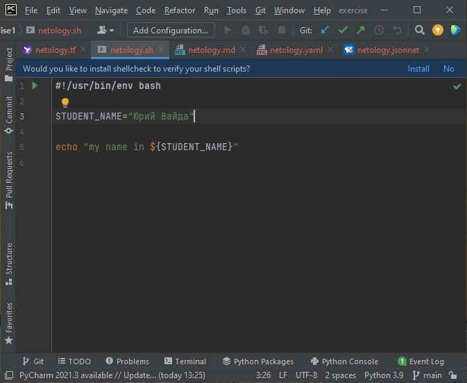
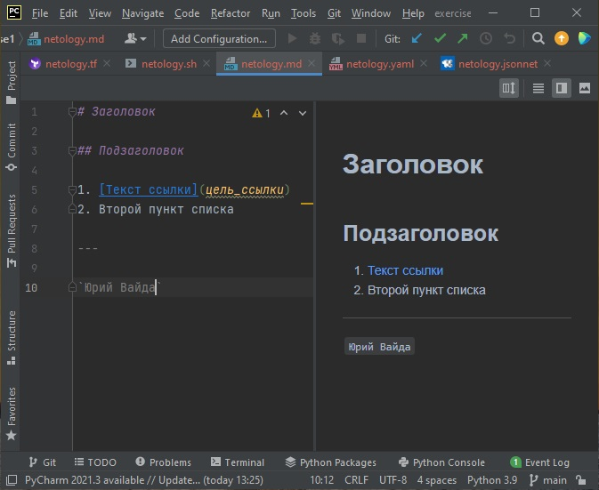
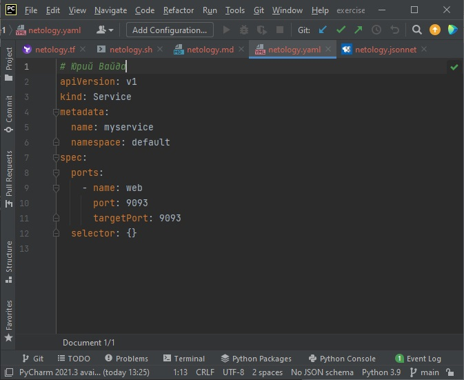
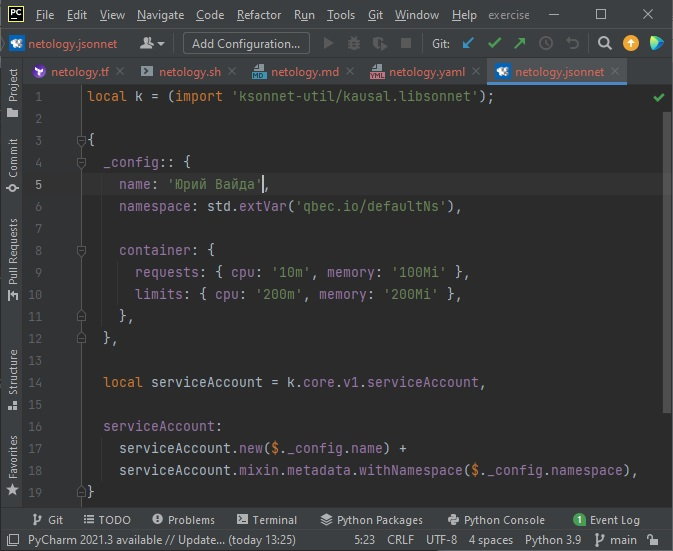

# Домашнее задание к занятию «1.1. Введение в DevOps»

## Задание №1 - Подготовка рабочей среды

### Снимки экранов:

  - Terraform:

  - Bash:

  - Markdown:

  - Yaml:

  - Jsonnet:

## Задание №2 - Описание жизненного цикла задачи (разработки нового функционала)

- ***Коммуникация***: анализ, декомпозиция задачи, анализ трудоемкости, согласование сроков, планирование, распределение задач `команда`
- ***Разработка***:
  - организация: инфраструктуры, CI `DevOps`
  - написание кода, разработка тестов `разработчики`
- ***Тестирование***
  - организация автоматического тестирования `DevOps`
  - тестирование `тестировщики`
  - проверка, демонстрация помежуточных результатов `менеджер`
- ***Внедрение и сопровождение***
  - выкладка в продакшн `DevOps`
  - организация мониторинга и оповещения о сбоях `DevOps`

  