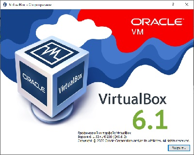
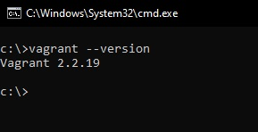
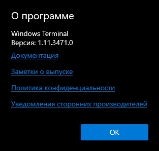

# 3.1. Работа в терминале, лекция 1

### 1. Установите средство виртуализации [Oracle VirtualBox](https://www.virtualbox.org/).

---




### 2. Установите средство автоматизации [Hashicorp Vagrant](https://www.vagrantup.com/).

---



### 3. В вашем основном окружении подготовьте удобный для дальнейшей работы терминал.

---



### 4. С помощью базового файла конфигурации запустите Ubuntu 20.04

---

```bash
vagrant up
```

### 5. Ознакомьтесь с графическим интерфейсом VirtualBox, посмотрите как выглядит виртуальная машина, которую создал для вас Vagrant, какие аппаратные ресурсы ей выделены. Какие ресурсы выделены по-умолчанию?

---

По умолчанию выделены:

```bash
Оперативная память: 1024 МБ
Процессоры:         2
Видеопамять:        4 МБ
HDD:                64 ГБ
```

### 6. Ознакомьтесь с возможностями конфигурации VirtualBox через Vagrantfile: [документация](https://www.vagrantup.com/docs/providers/virtualbox/configuration.html). Как добавить оперативной памяти или ресурсов процессора виртуальной машине?

---

```bash
config.vm.provider "virtualbox" do |v|
  v.memory = 2048
  v.cpus = 4
end
```

### 7. Команда `vagrant ssh` из директории, в которой содержится Vagrantfile, позволит вам оказаться внутри виртуальной машины без каких-либо дополнительных настроек. Попрактикуйтесь в выполнении обсуждаемых команд в терминале Ubuntu.

---

```bash
vagrant ssh
```

### 8. Ознакомиться с разделами `man bash`, почитать о настройках самого bash:
    * какой переменной можно задать длину журнала `history`, и на какой строчке manual это описывается?
    * что делает директива `ignoreboth` в bash?

---

Длина журнала задается с использованием переменной HISTSIZE. Описывается на 862 cтроке мануала.

ignoreboth является сокращением для директив ignorespace и ignoredups, наличие которой в HISTCONTROL приводит к тому, что в историю не будут попадать строки начинающиеся с пробела и строки, соответствующие предыдущей записи в истории.

### 9. В каких сценариях использования применимы скобки `{}` и на какой строчке `man bash` это описано?

---

Используются для написания выражений, интерпретирумеых механизмом раскрытия фигурных скобок (Brace expansion).
Описывается на 1091 строке мануала.


### 10. С учётом ответа на предыдущий вопрос, как создать однократным вызовом `touch` 100000 файлов? Получится ли аналогичным образом создать 300000? Если нет, то почему?

---

Создать однократным вызовом 100000 файлов можнос с помощью вызова touch {1..100000}.txt

При вызове touch {1..300000} произойдет ошибка "Argument list too long", которая возникает при невозможности разместить все аргументы команды в буфере, размер которого можно посмотреть с помощью команды getconf ARG_MAX


### 11. В man bash поищите по `/\[\[`. Что делает конструкция `[[ -d /tmp ]]`

---

Запись `[[ expression ]]` эквивалентна выполнению команды `test expression`. Возвращает 1 если выражение истинно, иначе 0.
Опция -d проверяет что файл существует и являет директорией.

```bash
if [[ -d /tmp ]]
then
echo "It's exists and is directory"
else
echo "It's impossible"
fi
```

### 12. Основываясь на знаниях о просмотре текущих (например, PATH) и установке новых переменных; командах, которые мы рассматривали, добейтесь в выводе type -a bash в виртуальной машине наличия первым пунктом в списке:

 ```bash
 bash is /tmp/new_path_directory/bash
 bash is /usr/local/bin/bash
 bash is /bin/bash
 ```
(прочие строки могут отличаться содержимым и порядком)
В качестве ответа приведите команды, которые позволили вам добиться указанного вывода или соответствующие скриншоты.

---

```bash
export PATH=/tmp/new_path_directory:/usr/local/bin:/bin:$PATH
sudo cp /usr/bin/bash /usr/local/bin
mkdir /tmp/new_path_directory
cp /usr/bin/bash /tmp/new_path_directory
type -a bash
```

### 13. Чем отличается планирование команд с помощью `batch` и `at`?

---

`at` позволяет задать дату и время одноразового выполнения команды, тогда как `batch` помещает задание очередь, которая выполняется в зависимости от загрузки системы

### 14. Завершите работу виртуальной машины чтобы не расходовать ресурсы компьютера и/или батарею ноутбука.

---

```bash
vagrant suspend
```
