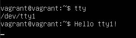

# 3.2. Работа в терминале, лекция 2

### 1. Какого типа команда `cd`? Попробуйте объяснить, почему она именно такого типа; опишите ход своих мыслей, если считаете что она могла бы быть другого типа.

---

Встроенная команда.

```bash
type -t cd

>>> builtin
```

### 2. Какая альтернатива без pipe команде `grep <some_string> <some_file> | wc -l`? `man grep` поможет в ответе на этот вопрос. Ознакомьтесь с [документом](http://www.smallo.ruhr.de/award.html) о других подобных некорректных вариантах использования pipe.

---

Альтернативой является опция `-с, --count`: 

```bash
grep -c <some_string> <some_file>
```

### 3. Какой процесс с PID `1` является родителем для всех процессов в вашей виртуальной машине Ubuntu 20.04?

---

```bash
pstree

>>> systemd
```

### 4. Как будет выглядеть команда, которая перенаправит вывод stderr `ls` на другую сессию терминала?

---

```bash
ls ./not-found 2> /dev/pts/1
```

### 5. Получится ли одновременно передать команде файл на stdin и вывести ее stdout в другой файл? Приведите работающий пример.

---

```bash
echo "Hello World!" > 1.txt
cat < 1.txt > 2.txt
cat 2.txt

>>> Hello World!
```

### 6. Получится ли находясь в графическом режиме, вывести данные из PTY в какой-либо из эмуляторов TTY? Сможете ли вы наблюдать выводимые данные?

---

```bash
echo "Hello tt1!" > /dev/tty1
```



### 7. Выполните команду `bash 5>&1`. К чему она приведет? Что будет, если вы выполните `echo netology > /proc/$$/fd/5`? Почему так происходит?

---

`bash 5>&1` Создает файловый дескриптор 5 и перенаправляет его на `STDOUT` (файловый дескриптор 1)

```bash
echo netology > /proc/$$/fd/5

>>> netology
```

приведет к выводу netology на экран, так как мы ранее перенаправили 5 на 1

### 8. Получится ли в качестве входного потока для pipe использовать только stderr команды, не потеряв при этом отображение stdout на pty? Напоминаем: по умолчанию через pipe передается только stdout команды слева от `|` на stdin команды справа.

---

```bash
ls ./not-found 2>&1 1>&5 | grep not-found

>>> ls: cannot access './not-found': No such file or directory
```

### 9. Что выведет команда `cat /proc/$$/environ`? Как еще можно получить аналогичный по содержанию вывод?

---

Переменные окружения

```bash
printenv
```

### 10. Используя `man`, опишите что доступно по адресам `/proc/<PID>/cmdline`, `/proc/<PID>/exe`.

---

`cmdline` - содержит команду с помощью которой был запущен процесс, а также переданные ей аргументы

`exe` - ссылка на исполняемый файл


### 11. Узнайте, какую наиболее старшую версию набора инструкций SSE поддерживает ваш процессор с помощью `/proc/cpuinfo`.

---

SSE 4.2

```bash
cat /proc/cpuinfo | grep sse
>>> flags: sse4_2
```

### 12. При открытии нового окна терминала и `vagrant ssh` создается новая сессия и выделяется pty. Это можно подтвердить командой `tty`, которая упоминалась в лекции 3.2. Однако:

 ```bash
 vagrant@netology1:~$ ssh localhost 'tty'
 not a tty
 ```

---

При использовании ssh для удаленного сеанса по умолчанию TTY не выделяется.
Когда ssh запускается локально, он хочет выделить TTY и в результате терпит неудачу, так как в текущем сеансе нет доступного TTY.

Для изменения поведения необходимо использовать опцию `-t` для ssh: `Force pseudo-terminal allocation`

### 13. Бывает, что есть необходимость переместить запущенный процесс из одной сессии в другую. Попробуйте сделать это, воспользовавшись `reptyr`. Например, так можно перенести в `screen` процесс, который вы запустили по ошибке в обычной SSH-сессии.

---

```bash
sudo apt update
sudo apt install reptyr
vim /etc/sysctl.d/10-ptrace.conf 

>>> kernel.yama.ptrace_scope = 0

pts/0:$ sleep 100000 &

>>> [1] 1440

pts/1:$ reptyr 1440
```

### 14. `sudo echo string > /root/new_file` не даст выполнить перенаправление под обычным пользователем, так как перенаправлением занимается процесс shell'а, который запущен без `sudo` под вашим пользователем. Для решения данной проблемы можно использовать конструкцию `echo string | sudo tee /root/new_file`. Узнайте что делает команда `tee` и почему в отличие от `sudo echo` команда с `sudo tee` будет работать.

---

`tee` используется для разделения выводимых программой данных, таким образом данные могут быть использованы для вывода в STDOUT и в файл.
При выполнении `sudo echo string > /root/new_file` в файл пишет shell, а при выполнении `echo string | sudo tee /root/new_file` права на запись будут именно у команды tee, пишущей в файл

