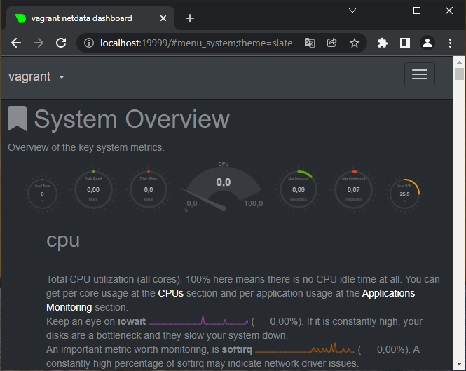

# 3.4. Операционные системы, лекция 2

#### 1. На лекции мы познакомились с [node_exporter](https://github.com/prometheus/node_exporter/releases). В демонстрации его исполняемый файл запускался в background. Этого достаточно для демо, но не для настоящей production-системы, где процессы должны находиться под внешним управлением. Используя знания из лекции по systemd, создайте самостоятельно простой [unit-файл](https://www.freedesktop.org/software/systemd/man/systemd.service.html) для node_exporter:

    * поместите его в автозагрузку,
    * предусмотрите возможность добавления опций к запускаемому процессу через внешний файл (посмотрите, например, на `systemctl cat cron`),
    * удостоверьтесь, что с помощью systemctl процесс корректно стартует, завершается, а после перезагрузки автоматически поднимается.

---

```bash
wget https://github.com/prometheus/node_exporter/releases/download/v1.3.1/node_exporter-1.3.1.linux-amd64.tar.gz
tar -xf node_exporter-0.17.0.linux-amd64.tar.gz
sudo cp -a node_exporter-1.3.1.linux-amd64/node_exporter /usr/local/bin/
```

/etc/systemd/system/node_exporter.service:
```bash
[Unit]
Description=Node Exporter

[Service]
EnvironmentFile=/etc/sysconfig/node_exporter
ExecStart=/usr/local/bin/node_exporter $OPTIONS

[Install]
WantedBy=multi-user.target
```
/etc/sysconfig/node_exporter:
```bash
OPTIONS=--web.disable-exporter-metrics
```
```bash
sudo systemctl daemon-reload
sudo systemctl enable node_exporter
sudo systemctl start node_exporter
sudo systemctl status node_exporter

>>> Node Exporter Active: active (running)...

sudo systemctl stop node_exporter
sudo systemctl status node_exporter

>>> Node Exporter Active: inactive(dead)...
```
```bash
vagrant reload
sudo systemctl status node_exporter

>>> Node Exporter Active: active (running)...
```

#### 2. Ознакомьтесь с опциями node_exporter и выводом `/metrics` по-умолчанию. Приведите несколько опций, которые вы бы выбрали для базового мониторинга хоста по CPU, памяти, диску и сети.

---

```bash
node_cpu_seconds_total
node_memory_MemFree_bytes
node_memory_SwapFree_bytes
node_disk_read_bytes_total
node_disk_read_time_seconds_total
node_disk_written_bytes_total
node_disk_write_time_seconds_total
node_network_transmit_bytes_total
node_network_receive_bytes_total
```

#### 3. Установите в свою виртуальную машину [Netdata](https://github.com/netdata/netdata). Воспользуйтесь [готовыми пакетами](https://packagecloud.io/netdata/netdata/install) для установки (`sudo apt install -y netdata`). После успешной установки:
    * в конфигурационном файле `/etc/netdata/netdata.conf` в секции [web] замените значение с localhost на `bind to = 0.0.0.0`,
    * добавьте в Vagrantfile проброс порта Netdata на свой локальный компьютер и сделайте `vagrant reload`:

    ```bash
    config.vm.network "forwarded_port", guest: 19999, host: 19999
    ```

    После успешной перезагрузки в браузере *на своем ПК* (не в виртуальной машине) вы должны суметь зайти на `localhost:19999`. Ознакомьтесь с метриками, которые по умолчанию собираются Netdata и с комментариями, которые даны к этим метрикам.
---



#### 4. Можно ли по выводу `dmesg` понять, осознает ли ОС, что загружена не на настоящем оборудовании, а на системе виртуализации?

---

Да

```bash
dmesg -T | grep virtual

>>> CPU MTRRs all blank - virtualized system.
>>> Booting paravirtualized kernel on KVM.
>>> systemd[1]: Detected virtualization oracle.
```

#### 5. Как настроен sysctl `fs.nr_open` на системе по-умолчанию? Узнайте, что означает этот параметр. Какой другой существующий лимит не позволит достичь такого числа (`ulimit --help`)?

---

```bash
sysctl fs.nr_open

>>> fs.nr_open = 1048576
```
sysctl fs.nr_open - Системное ограничение, максимально возможное количество открытых файловых дескрипторов.
Другие лимиты - пользовательские лимиты ресурсов для shell-а. 

```bash
ulimit -n [-S] // мягкий лимит

>>> 1024

ulimit -n -H // жесткий лимит

>>> 1048576
```

#### 6. Запустите любой долгоживущий процесс (не `ls`, который отработает мгновенно, а, например, `sleep 1h`) в отдельном неймспейсе процессов; покажите, что ваш процесс работает под PID 1 через `nsenter`. Для простоты работайте в данном задании под root (`sudo -i`). Под обычным пользователем требуются дополнительные опции (`--map-root-user`) и т.д.

---

```bash
sudo -i
unshare -f -p --mount-proc sleep 1h &
ps

>>> 1505 pts/0    00:00:00 sleep

nsenter -t 1505 -p -m
ps

>>> PID TTY          TIME CMD
>>>   1 pts/0    00:00:00 sleep 
```

#### 7. Найдите информацию о том, что такое `:(){ :|:& };:`. Запустите эту команду в своей виртуальной машине Vagrant с Ubuntu 20.04 (**это важно, поведение в других ОС не проверялось**). Некоторое время все будет "плохо", после чего (минуты) – ОС должна стабилизироваться. Вызов `dmesg` расскажет, какой механизм помог автоматической стабилизации. Как настроен этот механизм по-умолчанию, и как изменить число процессов, которое можно создать в сессии?

---

Fork бомба - один из видов DoS атак (атака на отказ в обслуживании). Объвляет функцкию `:`, которая вызывает саму себя и передает вывод еще одному фоновому вызову самой себя. После объявления производится вызов этой функции.

```bash
dmesg -T

>>> cgroup: fork rejected by pids controller in /user.slice/user-1000.slice/session-3.scope
```
Стабилизировала систему подсистема `pids` механизма `cgroups` (control groups), которая используется для ограничения количества процессов в рамках контрольной группы. 

```bash
systemctl show -p DefaultTasksMax

>>> DefaultTasksMax=1107

systemctl show user-1000.slice | grep Tasks

>>> TasksMax=2436
```

Изменить максимально число процессов в сессии можно:

```bash
ulimit -u

/etc/security/limits.conf npoc

systemctl set-property user[-{}].slice TasksMax={value}
```