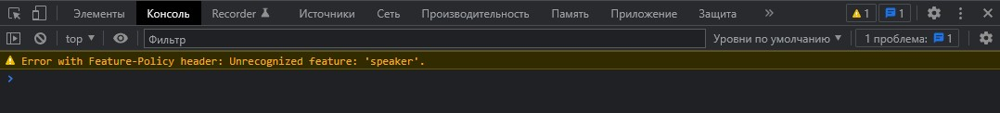
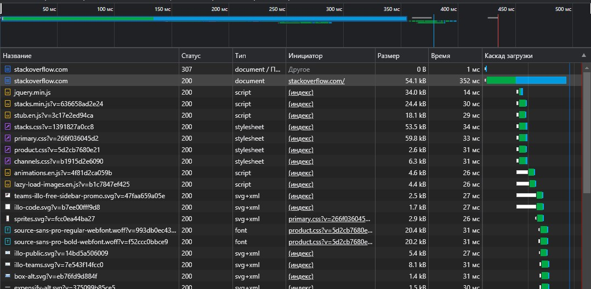

# 3.6. Компьютерные сети, лекция 1

#### 1. Работа c HTTP через телнет.
- Подключитесь утилитой телнет к сайту stackoverflow.com
`telnet stackoverflow.com 80`
- отправьте HTTP запрос
```bash
GET /questions HTTP/1.0
HOST: stackoverflow.com
[press enter]
[press enter]
```
- В ответе укажите полученный HTTP код, что он означает?
---

```bash
telnet stackoverflow.com 80
>>> Trying 151.101.129.69...
>>> Connected to stackoverflow.com.
>>> Escape character is '^]'.
GET /questions HTTP/1.0
HOST: stackoverflow.com

>>> HTTP/1.1 301 Moved Permanently
>>> location: https://stackoverflow.com/questions
```
`HTTP 301` - «Перемещено навсегда». Возвращается сервером в ситуации, когда запрошенный ресурс был на постоянной 
основе перемещён в новое месторасположение, и указывающий на то, что текущие ссылки, использующие данный URL, 
должны быть обновлены. Адрес нового месторасположения ресурса указывается в поле `Location` получаемого в ответ 
заголовка пакета протокола HTTP.

---

#### 2. Повторите задание 1 в браузере, используя консоль разработчика F12.
- откройте вкладку `Network`
- отправьте запрос http://stackoverflow.com
- найдите первый ответ HTTP сервера, откройте вкладку `Headers`
- укажите в ответе полученный HTTP код.
- проверьте время загрузки страницы, какой запрос обрабатывался дольше всего?
- приложите скриншот консоли браузера в ответ.
---
 - Первый ответ сервера: `HTTP 307 Internal Redirect`
 - Дольше всего обрабатывался запрос: `https://stackoverflow.com/`
 - Консоль браузера:

    

 - Вкладка `Network`:

    

---

#### 3. Какой IP адрес у вас в интернете?

---


---

#### 4. Какому провайдеру принадлежит ваш IP адрес? Какой автономной системе AS? Воспользуйтесь утилитой `whois`

---
```bash
whois 5.18.150.30

>>> role:           ER-Telecom ISP Contact Role
...
>>> origin:         AS41733
...
```
---

#### 5. Через какие сети проходит пакет, отправленный с вашего компьютера на адрес 8.8.8.8? Через какие AS? Воспользуйтесь утилитой `traceroute`

---
```bash
traceroute -An 8.8.8.8

...
>>>  4  5.19.0.178 [AS41733]  3.055 ms  3.899 ms  3.048 ms
>>>  5  188.234.131.158 [AS9049]  3.878 ms  3.382 ms  3.380 ms
>>>  6  188.234.131.159 [AS9049]  3.830 ms 72.14.214.138 [AS15169]  3.585 ms 188.234.131.159 [AS9049]  3.580 ms
>>>  7  * * *
>>>  8  209.85.245.238 [AS15169]  5.326 ms 209.85.240.254 [AS15169]  5.313 ms 216.239.59.142 [AS15169]  4.794 ms
>>>  9  74.125.244.180 [AS15169]  6.098 ms 74.125.244.132 [AS15169]  4.755 ms 74.125.244.181 [AS15169]  5.524 ms
>>> 10  72.14.232.85 [AS15169]  152.027 ms  152.016 ms 72.14.232.84 [AS15169]  5.532 ms
>>> 11  142.251.61.219 [AS15169]  8.365 ms 142.251.51.187 [AS15169]  14.104 ms 209.85.254.135 [AS15169]  8.644 ms
>>> 12  142.250.238.181 [AS15169]  8.955 ms * 172.253.79.115 [AS15169]  7.373 ms
...
```
---

#### 6. Повторите задание 5 в утилите `mtr`. На каком участке наибольшая задержка - delay?

---
```bash
mtr -zn 8.8.8.8

>>>                                             My traceroute  [v0.93]
>>> Keys:  Help   Display mode   Restart statistics   Order of fields   quit
>>>                                                                      Packets               Pings
>>>  Host                                                              Loss%   Snt   Last   Avg  Best  Wrst StDev
...
>>>  4. AS41733  5.19.0.178                                             0.0%    22    2.9   3.4   2.8   8.3   1.2
>>>  5. AS9049   188.234.131.158                                        0.0%    22    2.9   3.9   2.9  12.3   1.9
>>>  6. AS15169  72.14.214.138                                          0.0%    22    3.1   3.4   2.9   4.2   0.5
>>>  7. AS15169  172.253.76.91                                          0.0%    22    2.9   3.6   2.7   8.1   1.1
>>>  8. AS15169  74.125.244.181                                         0.0%    21    8.0   6.4   3.7  14.5   2.9
>>>  9. AS15169  142.251.51.187                                         0.0%    21    6.9  13.9   6.7  36.8   8.6
>>> 10. AS15169  216.239.63.25                                          0.0%    21    8.5   8.3   7.4   9.9   0.6
...
```
Наибольшая задержка:
```bash
среднее значение RTT: 13.9 
худшее значение RTT: 36.8

9. AS15169  142.251.51.187                                         0.0%    21    6.9  13.9   6.7  36.8   8.6
```
---

#### 7. Какие DNS сервера отвечают за доменное имя dns.google? Какие A записи? воспользуйтесь утилитой `dig`

---
```bash
dig +trace dns.google

dns.google.             10800   IN      NS      ns3.zdns.google.
dns.google.             10800   IN      NS      ns4.zdns.google.
dns.google.             10800   IN      NS      ns2.zdns.google.
dns.google.             10800   IN      NS      ns1.zdns.google.
;; Received 506 bytes from 216.239.36.105#53(ns-tld3.charlestonroadregistry.com) in 8 ms

dns.google.             900     IN      A       8.8.8.8
dns.google.             900     IN      A       8.8.4.4
;; Received 241 bytes from 216.239.36.114#53(ns3.zdns.google) in 8 ms
```
---

#### 8. Проверьте PTR записи для IP адресов из задания 7. Какое доменное имя привязано к IP? воспользуйтесь утилитой `dig`

---
```bash
dig -x 8.8.8.8

...
>>> ;; ANSWER SECTION:
>>> 8.8.8.8.in-addr.arpa.   20574   IN      PTR     dns.google.
...
```
---


