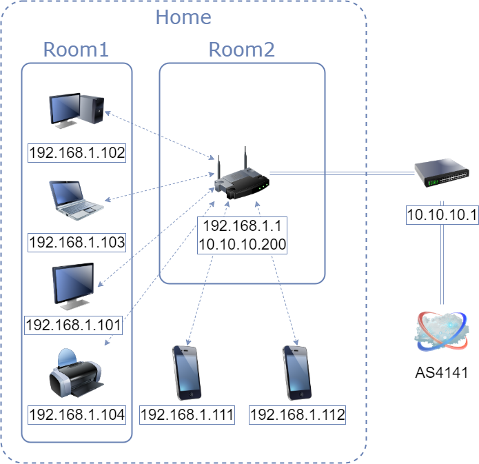

# 3.8. Компьютерные сети, лекция 3

#### 1. Подключитесь к публичному маршрутизатору в интернет. Найдите маршрут к вашему публичному IP
```bash
telnet route-views.routeviews.org
Username: rviews
show ip route x.x.x.x/32
show bgp x.x.x.x/32
```
---
```bash
telnet route-views.routeviews.org
>>> Username: rviews

route-views>show ip route 8.8.8.8 255.255.255.0
>>> Routing entry for 8.8.8.0/24
>>> Known via "bgp 6447", distance 20, metric 0
>>>   Tag 7018, type external
>>>   Last update from 12.0.1.63 4w0d ago
>>>   Routing Descriptor Blocks:
>>>   * 12.0.1.63, from 12.0.1.63, 4w0d ago
>>>       Route metric is 0, traffic share count is 1
>>>       AS Hops 2
>>>       Route tag 7018
>>>       MPLS label: none

route-views>show bgp 8.8.8.8/24
>>> BGP routing table entry for 8.8.8.0/24, version 307553782
>>> Paths: (22 available, best #16, table default)
>>>   Not advertised to any peer
...
>>> Refresh Epoch 1
>>>   7018 15169
>>>     12.0.1.63 from 12.0.1.63 (12.0.1.63)
>>>       Origin IGP, localpref 100, valid, external, best
>>>       Community: 7018:2500 7018:37232
>>>       path 7FE0D1FF5C78 RPKI State valid
>>>       rx pathid: 0, tx pathid: 0x0
...
```

#### 2. Создайте dummy0 интерфейс в Ubuntu. Добавьте несколько статических маршрутов. Проверьте таблицу маршрутизации.

---
```bash
echo "dummy" | sudo tee -a /etc/modules
echo "options dummy numdummies=1" | sudo tee -a /etc/modprobe.d/systemd.conf
sudo vim /etc/netplan/01-netcfg.yaml

>>>
network:
  version: 2
  ethernets:
    ...
    dummy0:
      routes:
      - to: 192.168.0.0/24
        via: 192.168.0.1
      - to: 192.168.1.0/24
        via: 192.168.1.1

ip a
...
>>> 4: dummy0: <BROADCAST,NOARP,UP,LOWER_UP> mtu 1500 qdisc noqueue state UNKNOWN group default qlen 1000
>>>     link/ether 96:d9:41:ca:45:d6 brd ff:ff:ff:ff:ff:ff
>>>     inet6 fe80::94d9:41ff:feca:45d6/64 scope link
>>>        valid_lft forever preferred_lft forever

ip route show
...
>>> 192.168.0.0/24 via 192.168.0.1 dev dummy0 proto static onlink
>>> 192.168.1.0/24 via 192.168.1.1 dev dummy0 proto static onlink
```

#### 3. Проверьте открытые TCP порты в Ubuntu, какие протоколы и приложения используют эти порты? Приведите несколько примеров.

---
```bash
sudo netstat -nat

>>> Active Internet connections (servers and established)
>>> Proto Recv-Q Send-Q Local Address           Foreign Address         State
>>> tcp        0      0 127.0.0.53:53           0.0.0.0:*               LISTEN
>>> tcp        0      0 0.0.0.0:22              0.0.0.0:*               LISTEN
>>> tcp        0      0 10.0.2.15:22            10.0.2.2:53751          ESTABLISHED
>>> tcp6       0      0 :::22                   :::*                    LISTEN
```
- 22: SSH - Secure SHell
- 53: DNS - Domain Name System


#### 4. Проверьте используемые UDP сокеты в Ubuntu, какие протоколы и приложения используют эти порты?

---
```bash
sudo netstat -napu

>>> Active Internet connections (servers and established)
>>> Proto Recv-Q Send-Q Local Address           Foreign Address         State       PID/Program name
>>> udp        0      0 127.0.0.53:53           0.0.0.0:*                           601/systemd-resolve
>>> udp        0      0 10.0.2.15:68            0.0.0.0:*                           599/systemd-network
```
- 53: DNS - Domain Name System
- 68: DHCP - Dynamic Host Configuration Protocol

#### 5. Используя diagrams.net, создайте L3 диаграмму вашей домашней сети или любой другой сети, с которой вы работали. 

---

