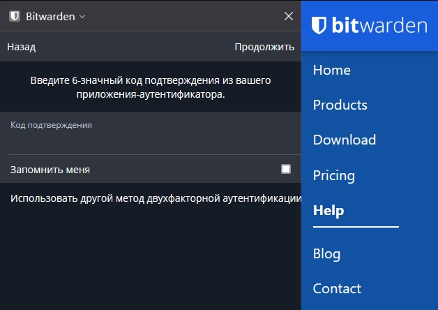

# 3.9. Элементы безопасности информационных систем

#### 1. Установите Bitwarden плагин для браузера. Зарегестрируйтесь и сохраните несколько паролей.

---


#### 2. Установите Google authenticator на мобильный телефон. Настройте вход в Bitwarden акаунт через Google authenticator OTP.

---

- 
- 

#### 3. Установите apache2, сгенерируйте самоподписанный сертификат, настройте тестовый сайт для работы по HTTPS.

---
```bash
config.vm.network "forwarded_port", guest: 443, host: 7443
```

```bash
sudo apt install apache2
sudo mkdir /var/www/example
sudo chmod -R 755 /var/www/example
sudo vim /var/www/example/index.html

sudo openssl req -x509 -nodes -days 365 -newkey rsa:2048 -keyout /etc/ssl/private/apache-selfsigned.key \
    -out /etc/ssl/certs/apache-selfsigned.crt

>>> Country Name (2 letter code) [AU]:RU
>>> State or Province Name (full name) [Some-State]:Region
>>> Locality Name (eg, city) []:Home City
>>> Organization Name (eg, company) [Internet Widgits Pty Ltd]:Home
>>> Organizational Unit Name (eg, section) []:Root
>>> Common Name (e.g. server FQDN or YOUR name) []:localhost
>>> Email Address []:webadmin@localhost

sudo vim /etc/apache2/conf-available/ssl-params.conf

>>> SSLCipherSuite EECDH+AESGCM:EDH+AESGCM:AES256+EECDH:AES256+EDH
>>> SSLProtocol All -SSLv2 -SSLv3 -TLSv1 -TLSv1.1
>>> SSLHonorCipherOrder On
>>> # Disable preloading HSTS for now.  You can use the commented out header line that includes
>>> # the "preload" directive if you understand the implications.
>>> # Header always set Strict-Transport-Security "max-age=63072000; includeSubDomains; preload"
>>> Header always set X-Frame-Options DENY
>>> Header always set X-Content-Type-Options nosniff
>>> # Requires Apache >= 2.4
>>> SSLCompression off
>>> SSLUseStapling on
>>> SSLStaplingCache "shmcb:logs/stapling-cache(150000)"
>>> # Requires Apache >= 2.4.11
>>> SSLSessionTickets Off

sudo vim /etc/apache2/sites-available/default-ssl.conf

...
>>> ServerAdmin webadmin@localhost
>>> DocumentRoot /var/www/example
...
>>> SSLCertificateFile      /etc/ssl/certs/apache-selfsigned.crt
>>> SSLCertificateKeyFile /etc/ssl/private/apache-selfsigned.key
...

sudo a2enmod ssl
sudo a2enmod headers
sudo a2ensite default-ssl
sudo a2enconf ssl-params
sudo systemctl restart apache2
```


#### 4. Проверьте на TLS уязвимости произвольный сайт в интернете (кроме сайтов МВД, ФСБ, МинОбр, НацБанк, РосКосмос, РосАтом, РосНАНО и любых госкомпаний, объектов КИИ, ВПК ... и тому подобное).

---
```bash
git clone --depth 1 https://github.com/drwetter/testssl.sh.git
cd testssl.sh
./testssl.sh -U --sneaky https://netology.ru/

...
>>> BREACH (CVE-2013-3587)                    potentially NOT ok, "gzip" HTTP compression detected. - only supplied "/" tested
...
>>> SWEET32 (CVE-2016-2183, CVE-2016-6329)    VULNERABLE, uses 64 bit block ciphers
...
>>> BEAST (CVE-2011-3389)                     TLS1: ECDHE-RSA-AES128-SHA AES128-SHA ECDHE-RSA-AES256-SHA
>>>                                                  AES256-SHA DES-CBC3-SHA
>>>                                           VULNERABLE -- but also supports higher protocols  TLSv1.1 TLSv1.2 (likely mitigated)
>>> LUCKY13 (CVE-2013-0169), experimental     potentially VULNERABLE, uses cipher block chaining (CBC) ciphers with TLS. Check patches
...
>>> Done 2022-03-17 11:24:12 [  33s] -->> 188.114.98.128:443 (netology.ru) <<--
```

#### 5. Установите на Ubuntu ssh сервер, сгенерируйте новый приватный ключ. Скопируйте свой публичный ключ на другой сервер. Подключитесь к серверу по SSH-ключу.

---
```bash
sudo apt install openssh-server
sudo systemctl start sshd.service
sudo systemctl enable sshd.service
ssh-keygen -t rsa -b 4096

>>> Enter file in which to save the key (/home/vagrant/.ssh/id_rsa):
>>> Enter passphrase (empty for no passphrase):
...

>>> SHA256:ZIcpdq+Hrz4HWoBTkhx5RNV1/pVOYNSWPN4IAtDjCHU vagrant@netology2
>>> The key's randomart image is:
>>> +---[RSA 4096]----+
>>> |   ..B=+Eo .o++ .|
>>> |    * o.ooo oo.*.|
>>> |     *oo*... .+++|
>>> |    o.o=.o    +oo|
>>> |     . .S .    ..|
>>> |        oo       |
>>> |       oo..      |
>>> |      . .o.      |
>>> |       .o+.      |
>>> +----[SHA256]-----+

ssh-copy-id vagrant@172.28.128.10

...
>>> Now try logging into the machine, with:   "ssh 'vagrant@172.28.128.10'"
>>> and check to make sure that only the key(s) you wanted were added.

ssh vagrant@172.28.128.10

>>> Welcome to Ubuntu 20.04.3 LTS (GNU/Linux 5.4.0-91-generic x86_64)
...
```
 
#### 6. Переименуйте файлы ключей из задания 5. Настройте файл конфигурации SSH клиента, так чтобы вход на удаленный сервер осуществлялся по имени сервера.

---
```bash
ssh-keygen -t rsa -b 4096
>>> Enter file in which to save the key (/home/vagrant/.ssh/id_rsa): /home/vagrant/.ssh/netology
>>> Enter passphrase (empty for no passphrase):
...

ssh-copy-id -i /home/vagrant/.ssh/netology vagrant@172.28.128.10

touch ~/.ssh/config
sudo vim ~/.ssh/config

>>> Host netology1
>>>     HostName 172.28.128.10
>>>     User vagrant
>>>     IdentityFile /home/vagrant/.ssh/netology

ssh netology1

>>> Welcome to Ubuntu 20.04.3 LTS (GNU/Linux 5.4.0-91-generic x86_64)
...
```

#### 7. Соберите дамп трафика утилитой tcpdump в формате pcap, 100 пакетов. Откройте файл pcap в Wireshark.

---
sudo tcpdump port ssh -i eth0 -w ssh.pcap -c 100


